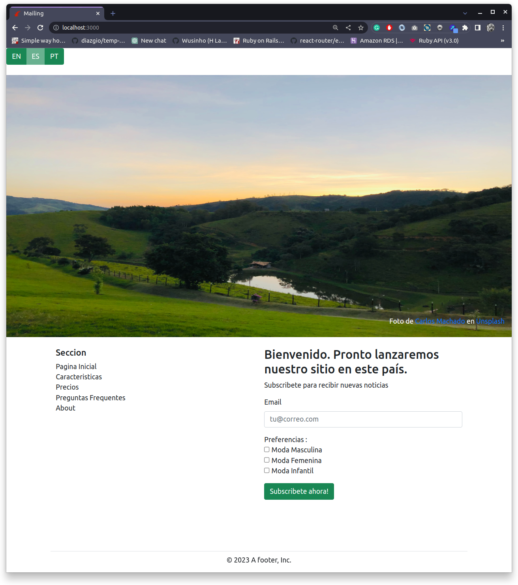

# Mailing System


## Summary

The project aims to revolutionize the process of updating and managing portfolios by introducing seamless automation. By leveraging GraphQL requests, the project enables automatic updates of the portfolio based on changes in the user's GitHub profile and pinned repositories.

## Objectives

- The email and user preferences must be stored in Database.
- The same email cannot be registered twice, an error message will be displayed to the user indicating that the email already exists.
- Make a simple validation of the user's input to guarantee that what they have entered complies with the valid format of an email.
- The user may select one or more preferences, but they must select at least one of them.
- Once the user has been registered successfully, an email will be sent confirming their subscription.
- Even if the email has a valid format, that does not mean that it is an existing email. It could be that the domain does not exist, or it is not configured to receive mail. To prevent submitting this type of email, we will only accept those that obtain a score greater than 0.7 when looking up in this API:
- The landing page will be used in several countries, therefore it should be prepared to adapt it to three different languages. This is what we know in software development as internationalization (i18n).
- It is not necessary to translate the texts to other languages, but the project must be prepared to be easily localized without needing to make changes to the code (through a file containing the translations, for example).
- After successfully registering the subscriber's email and preferences, the user will be able to answer a survey to obtain a discount coupon. The survey can be a multi-step form of 3-5 questions.

## Description of the Project

For the development of the project, the following tools were used:

- Rails v 7.0.4
- Ruby 3.2.0
- Postgresql
- Bootstrap v 5.1.3

The purpose of the project is to build a landing page with a functional newsletter submission. 
After a user subscribes to the mailer, a message will be sent. There are 2 options to fill in the survey
from the actual landing_page, and through a link in the mail.

### Additional details

To enhance the functionality of the question model, we can introduce an association called question_category and incorporate an additional model called category. This modification will allow us to utilize tags, enabling questions to be easily searchable and reusable for other surveys.

Furthermore, we can consider transforming the Survey model into a polymorphic table. This adjustment will provide greater flexibility and adaptability, allowing for more diverse types of surveys to be created and managed efficiently.

By implementing these enhancements, we can elevate the professionalism and effectiveness of the survey system, empowering users with advanced features and improved usability.





### **Endpoints of API**

| Method | Endpoint    |               Functionality |
|--------| ----------- |----------------------------:|
| GET    | home        |                 Lading Page |
| POST   | subscriptions |        Create subscriptions |
| GET    | surveys |                 Show Survey |
| POST   | surveys | Create Survey and Questions |
| PATCH  | surveys |      Update Survey Answer's |

## How to start the project from your Local environment
- For the validation API email validation to work, you need to put your own API KEY on:
[validatetable.rb](./app/models/concerns/validatetable.rb)

- Open your terminal and cd where you want to store the project
- Run the following command in the terminal
```bash
git clone https://github.com/Wusinho/mailing_test.git
```
- Cd into the created directory
- Run $ `bundle install`
- On terminal type $ `rails db:create && rails db:migrate && rails db:seed`
- On terminal type $ `rails server`

## Author

👤 **Heber Lazo**

- Github: [@Wusinho](https://github.com/Wusinho)
- LinkedIn: [Heber Lazo](https://www.linkedin.com/in/heber-lazo-benza-523266133/)

## 🤝 Contributing

Contributions, issues, and feature requests are welcome!

## Show your support

Give a star if you :star: like this project!

